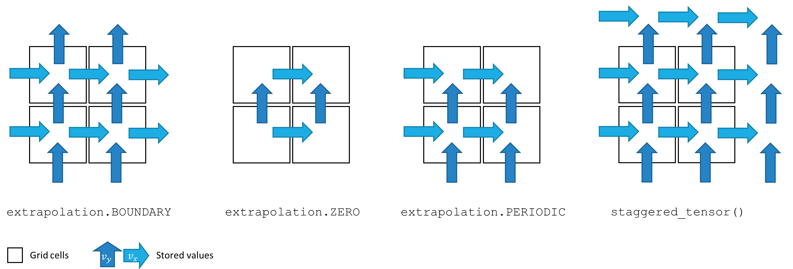

# Staggered grids

Staggered grids are a key component of the marker-and-cell (MAC) method \[Harlow and Welch 1965\].
They sample the velocity components not at the cell centers but in staggered form at the corresponding face centers.
Since cells have two faces along each dimension, the number of sample points can vary between components.

A central advantage of Staggered grids is that the divergence of a cell can be computed exactly.



In Φ<sub>Flow</sub>, staggered grids are represented as instances of [`StaggeredGrid`](phi/field/#phi.field.StaggeredGrid).
Like `CenteredGrid`, they inherit the following attributes:
 
* `bounds: Box`, `resolution: Shape`, `dx: Tensor` from `Grid`
* `values: Tensor`, `elements: Geometry`, `points: Tensor`, `extrapolation: Extrapolation` from `SampledField`

At the same resolution, staggered grids have more sample points than centered grids.
The shape of the data arrays also varies along the 'vector' dimension.
The `values` tensor is always [non-uniform](https://tum-pbs.github.io/PhiFlow/Math.html#non-uniform-tensors).


## Creating staggered grids

There exist two ways of directly constructing a `StaggeredGrid`.

In the presence of a `Domain`, the preferred way is to use the domain methods.
```python
DOMAIN.staggered_grid(values)  # uses the domain's vector extrapolation property
DOMAIN.grid(values, type=StaggeredGrid)  # uses the domain's general extrapolation property
```

Otherwise, `StaggeredGrid.sample()` provides a convenient way of constructing staggered grids from
other `Field`s,
`Geometry` objects,
functions,
value `Tensor`s or
numbers.

```python
StaggeredGrid.sample(0, math.shape(x=5, y=4), Box[0:.5, 0:.4])
# Out: StaggeredGrid[(x=5, y=4, vector=2), size=[0.5 0.4]]
```

Using the `StaggeredGrid()` constructor directly is not recommended.


Staggered grids can also be created from corresponding `CenteredGrids`.
Here are some examples of functions that return `StaggeredGrid`s.

```python
DOMAIN = Domain(x=5, y=4)
grid = DOMAIN.grid(1)

grid >> DOMAIN.staggered_grid()  # resample
# Out: StaggeredGrid[(x=5, y=4, vector=2), size=(5, 4) along vector, extrapolation=0]

field.spatial_gradient(grid, type=StaggeredGrid)
# Out: StaggeredGrid[(x=5, y=4, vector=2), size=(5, 4) along vector, extrapolation=0]

field.stagger(grid, math.minimum, math.extrapolation.ZERO)  # min value of the two cells sharing the face
# Out: StaggeredGrid[(x=5, y=4, vector=2), size=(5, 4) along vector, extrapolation=0]

field.stagger(grid, lambda *x: math.mean(x, dim=0),
              math.extrapolation.ZERO)  # mean value from the two cells sharing the face
# Out: StaggeredGrid[(x=5, y=4, vector=2), size=(5, 4) along vector, extrapolation=0]
```

Likewise, the points can be interpolated to the cell centers using the method `at_centers()`.

Note that calling `StaggeredGrid.unstack('vector')` returns a tuple of `CenteredGrid` objects.
Unstacking along any other dimension returns a tuple of `StaggeredGrid`s.
